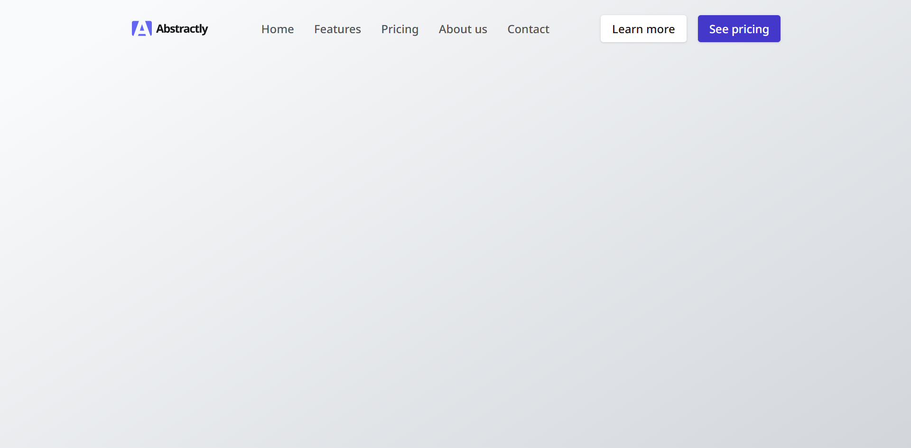

# Navbar Component

This is the solution for the **Navbar Component** project from [GreatFrontEnd](https://www.greatfrontend.com/projects).  
This component adapts across desktop, tablet, and mobile, providing a smooth and accessible navigation experience.

---

## 📸 Preview

---

## 📌 Features

- ✅ Responsive layout: desktop, tablet, and mobile.
- ✅ Accessible HTML structure with `aria-label` and keyboard navigation.
- ✅ BEM methodology for class naming.
- ✅ Hover and focus states for better usability.

---

## 🛠️ Built with

- HTML5
- CSS3 (BEM + utility classes)
- [Font Awesome](https://fontawesome.com/) for social media icons
- [Google Fonts](https://fonts.google.com/) – Noto Sans

---

## 🚀 Live Demo

- **Repository**: [GitHub Repo](https://github.com/abilioassis/gfe-navbar-component)
- **Live Preview**: [Netlify](https://abilio-gfe-navbar-component.netlify.app/)

---

## 👤 Author

- Built by [Abilio de Assis](https://www.greatfrontend.com/projects/u/abiliodeassis)
