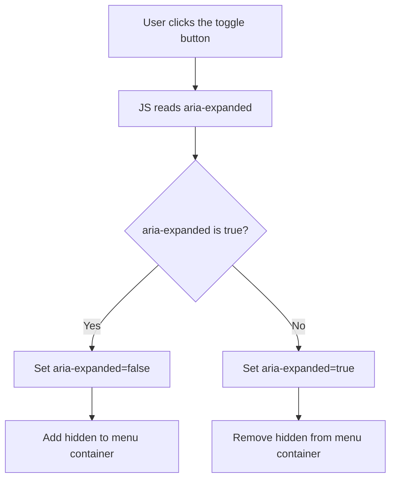

```mermaid
flowchart TD
    A[User clicks the toggle button] --> B[JS reads aria-expanded]
    B --> C{aria-expanded is true?}
    C -- Yes --> D[Set aria-expanded=false]
    D --> E[Add hidden to menu container]
    C -- No --> F[Set aria-expanded=true]
    F --> G[Remove hidden from menu container]
```
